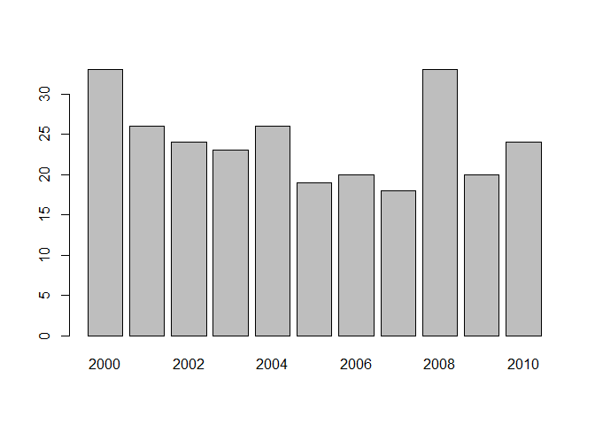

## Introduction

This R markdown document is the guideline for the first part of the
practicum.

In this part we are going to put in practice the commands explained in
the previous session to characterize a database. The database that we
are are going to use is a modified version of
[Eunomia](https://github.com/OHDSI/Eunomia) using
[duckdb](https://cran.r-project.org/web/packages/duckdb/duckdb.pdf) and
[CDMConnector](https://odyosg.github.io/CDMConnector/).

This document contain the tasks that we must try to complete during this
session. If at some point we are not able to proceed, ask help to any of
the nice and ready to help guys. Also, the .Rmd file contains the
solutions, although it is not recommended to use.

### Let’s get started!

Install CDMConnector:

    install.packages("devtools")
    # When ready we are going to add it to the darwin github:
    # devtools::install_github("darwin-eu/CDMConnector")
    # For the moment we have it on OdyOSG:
    devtools::install_github("OdyOSG/CDMConnector")

To connect to the database use the following commands:

    library("DBI")
    library("dplyr")
    library("dbplyr")
    library("CDMConnector")
    library("duckdb")

    con <- dbConnect(duckdb(), dbdir = eunomia_dir())
    cdm <- cdm_from_con(con, cdm_schema = "main")

#### Read tables

To read ‘person’ and ‘observation\_period’ tables we can use the
following commands:

    person_db <- tbl(con, "PERSON") # using DBI way
    person_db

    ## # Source:   table<PERSON> [?? x 18]
    ## # Database: DuckDB 0.5.1 [martics@Windows 10 x64:R 4.2.1/C:\Users\martics\AppData\Local\Temp\RtmpmElS41/jjpdkgfu/cdm.duckdb]
    ##    person_id gende…¹ year_…² month…³ day_o…⁴ birth_datetime      race_…⁵ ethni…⁶
    ##        <dbl>   <dbl>   <dbl>   <dbl>   <dbl> <dttm>                <dbl>   <dbl>
    ##  1         6    8532    1963      12      31 1963-12-31 00:00:00    8516       0
    ##  2       123    8507    1950       4      12 1950-04-12 00:00:00    8527       0
    ##  3       129    8507    1974      10       7 1974-10-07 00:00:00    8527       0
    ##  4        16    8532    1971      10      13 1971-10-13 00:00:00    8527       0
    ##  5        65    8532    1967       3      31 1967-03-31 00:00:00    8516       0
    ##  6        74    8532    1972       1       5 1972-01-05 00:00:00    8527       0
    ##  7        42    8532    1909      11       2 1909-11-02 00:00:00    8527       0
    ##  8       187    8507    1945       7      23 1945-07-23 00:00:00    8527       0
    ##  9        18    8532    1965      11      17 1965-11-17 00:00:00    8527       0
    ## 10       111    8532    1975       5       2 1975-05-02 00:00:00    8527       0
    ## # … with more rows, 10 more variables: location_id <lgl>, provider_id <lgl>,
    ## #   care_site_id <lgl>, person_source_value <chr>, gender_source_value <chr>,
    ## #   gender_source_concept_id <dbl>, race_source_value <chr>,
    ## #   race_source_concept_id <dbl>, ethnicity_source_value <chr>,
    ## #   ethnicity_source_concept_id <dbl>, and abbreviated variable names
    ## #   ¹​gender_concept_id, ²​year_of_birth, ³​month_of_birth, ⁴​day_of_birth,
    ## #   ⁵​race_concept_id, ⁶​ethnicity_concept_id

    person_db <- cdm$person # using CDMConnector
    person_db

    ## # Source:   table<main.person> [?? x 18]
    ## # Database: DuckDB 0.5.1 [martics@Windows 10 x64:R 4.2.1/C:\Users\martics\AppData\Local\Temp\RtmpmElS41/jjpdkgfu/cdm.duckdb]
    ##    person_id gende…¹ year_…² month…³ day_o…⁴ birth_datetime      race_…⁵ ethni…⁶
    ##        <dbl>   <dbl>   <dbl>   <dbl>   <dbl> <dttm>                <dbl>   <dbl>
    ##  1         6    8532    1963      12      31 1963-12-31 00:00:00    8516       0
    ##  2       123    8507    1950       4      12 1950-04-12 00:00:00    8527       0
    ##  3       129    8507    1974      10       7 1974-10-07 00:00:00    8527       0
    ##  4        16    8532    1971      10      13 1971-10-13 00:00:00    8527       0
    ##  5        65    8532    1967       3      31 1967-03-31 00:00:00    8516       0
    ##  6        74    8532    1972       1       5 1972-01-05 00:00:00    8527       0
    ##  7        42    8532    1909      11       2 1909-11-02 00:00:00    8527       0
    ##  8       187    8507    1945       7      23 1945-07-23 00:00:00    8527       0
    ##  9        18    8532    1965      11      17 1965-11-17 00:00:00    8527       0
    ## 10       111    8532    1975       5       2 1975-05-02 00:00:00    8527       0
    ## # … with more rows, 10 more variables: location_id <lgl>, provider_id <lgl>,
    ## #   care_site_id <lgl>, person_source_value <chr>, gender_source_value <chr>,
    ## #   gender_source_concept_id <dbl>, race_source_value <chr>,
    ## #   race_source_concept_id <dbl>, ethnicity_source_value <chr>,
    ## #   ethnicity_source_concept_id <dbl>, and abbreviated variable names
    ## #   ¹​gender_concept_id, ²​year_of_birth, ³​month_of_birth, ⁴​day_of_birth,
    ## #   ⁵​race_concept_id, ⁶​ethnicity_concept_id

    person_db <- cdm[["person"]]
    person_db

    ## # Source:   table<main.person> [?? x 18]
    ## # Database: DuckDB 0.5.1 [martics@Windows 10 x64:R 4.2.1/C:\Users\martics\AppData\Local\Temp\RtmpmElS41/jjpdkgfu/cdm.duckdb]
    ##    person_id gende…¹ year_…² month…³ day_o…⁴ birth_datetime      race_…⁵ ethni…⁶
    ##        <dbl>   <dbl>   <dbl>   <dbl>   <dbl> <dttm>                <dbl>   <dbl>
    ##  1         6    8532    1963      12      31 1963-12-31 00:00:00    8516       0
    ##  2       123    8507    1950       4      12 1950-04-12 00:00:00    8527       0
    ##  3       129    8507    1974      10       7 1974-10-07 00:00:00    8527       0
    ##  4        16    8532    1971      10      13 1971-10-13 00:00:00    8527       0
    ##  5        65    8532    1967       3      31 1967-03-31 00:00:00    8516       0
    ##  6        74    8532    1972       1       5 1972-01-05 00:00:00    8527       0
    ##  7        42    8532    1909      11       2 1909-11-02 00:00:00    8527       0
    ##  8       187    8507    1945       7      23 1945-07-23 00:00:00    8527       0
    ##  9        18    8532    1965      11      17 1965-11-17 00:00:00    8527       0
    ## 10       111    8532    1975       5       2 1975-05-02 00:00:00    8527       0
    ## # … with more rows, 10 more variables: location_id <lgl>, provider_id <lgl>,
    ## #   care_site_id <lgl>, person_source_value <chr>, gender_source_value <chr>,
    ## #   gender_source_concept_id <dbl>, race_source_value <chr>,
    ## #   race_source_concept_id <dbl>, ethnicity_source_value <chr>,
    ## #   ethnicity_source_concept_id <dbl>, and abbreviated variable names
    ## #   ¹​gender_concept_id, ²​year_of_birth, ³​month_of_birth, ⁴​day_of_birth,
    ## #   ⁵​race_concept_id, ⁶​ethnicity_concept_id

All the available tables can be observed in:

    cat(paste0("There exist a total of: ", length(cdm), " tables."))

    ## There exist a total of: 28 tables.

    names(cdm)

    ##  [1] "person"               "observation_period"   "visit_occurrence"    
    ##  [4] "visit_detail"         "condition_occurrence" "drug_exposure"       
    ##  [7] "procedure_occurrence" "device_exposure"      "measurement"         
    ## [10] "observation"          "death"                "note"                
    ## [13] "note_nlp"             "specimen"             "fact_relationship"   
    ## [16] "location"             "care_site"            "provider"            
    ## [19] "payer_plan_period"    "cost"                 "drug_era"            
    ## [22] "dose_era"             "condition_era"        "concept"             
    ## [25] "vocabulary"           "concept_relationship" "concept_ancestor"    
    ## [28] "drug_strength"

## Tasks

### 1) Compute the number of rows in each table

Tips, we have seen: A function that gives us the names of the available
tables of cdm:
[names](https://www.rdocumentation.org/packages/base/versions/3.6.2/topics/names)

A function to compute the number of rows of a table (that it is in the R
memory):
[nrow](https://www.rdocumentation.org/packages/base/versions/3.6.2/topics/nrow)

A function to count observations of a table (that its is in the database
side):
[tally](https://www.rdocumentation.org/packages/dplyr/versions/0.5.0/topics/tally)

Making a loop (or using lapply or related functions for advanced users)
may be a good way to optimize the process.

SOLUTION

    ##                   table nrows
    ## 1                person  2694
    ## 2    observation_period  5343
    ## 3      visit_occurrence  1037
    ## 4          visit_detail     0
    ## 5  condition_occurrence 65332
    ## 6         drug_exposure 67707
    ## 7  procedure_occurrence 37409
    ## 8       device_exposure     0
    ## 9           measurement 44053
    ## 10          observation  1477
    ## 11                death     0
    ## 12                 note     0
    ## 13             note_nlp     0
    ## 14             specimen     0
    ## 15    fact_relationship     0
    ## 16             location     0
    ## 17            care_site     0
    ## 18             provider     0
    ## 19    payer_plan_period     0
    ## 20                 cost     0
    ## 21             drug_era 52508
    ## 22             dose_era     0
    ## 23        condition_era 65719
    ## 24              concept   444
    ## 25           vocabulary   125
    ## 26 concept_relationship     8
    ## 27     concept_ancestor 65690
    ## 28        drug_strength     0

### 2) List the empty tables

SOLUTION

    ## The empty tables are: visit_detail, device_exposure, death, note, note_nlp, specimen, fact_relationship, location, care_site, provider, payer_plan_period, cost, dose_era, drug_strength.

### 3) Compute the number of different individuals per table\*

\*only the ones that contain PERSON\_ID identifier

Tips, we have seen: select, distinct, tally, pull…

SOLUTION

    ##                   table NumberIndividuals
    ## 1                person              2694
    ## 2    observation_period              5343
    ## 3      visit_occurrence               890
    ## 4          visit_detail                 0
    ## 5  condition_occurrence              2694
    ## 6         drug_exposure              2694
    ## 7  procedure_occurrence              2593
    ## 8       device_exposure                 0
    ## 9           measurement              2686
    ## 10          observation               671
    ## 11                death                 0
    ## 12                 note                 0
    ## 13             specimen                 0
    ## 14    payer_plan_period                 0
    ## 15             drug_era              2694
    ## 16             dose_era                 0
    ## 17        condition_era              2694

### 4) Find and sort the 10 most recurrent ‘concept\_name’ in the following cases:

Tips, we have seen: select, rename, distinct, tally, pull, collect,
nrow, left\_join, anti\_join…

table.i &lt;- table.i %&gt;% arrange(variablex) is used to order the
table.i according to increassing variablex value.

table.i &lt;- table.i %&gt;% arrange(desc(variablex)) is used to order
the table.i according to decreasing variablex value.

arrange is always the last step!

table.i &lt;- table.i %&gt;% head(kk) is used to just show the first kk
elements of table.i.

The ‘concept\_name’ is in ‘concept’ table and can be related to a
‘concept\_id’ that has a different name in each table
(e.g. ‘condition\_concept\_id’ in ‘condition\_occurrence’ table,
‘drug\_concept\_id’ in ‘drug\_era’ table, …)

### 4.1) in CONDITION\_OCCURRENCE table

SOLUTION

    ## # A tibble: 10 × 2
    ##    concept_name                                 n
    ##    <chr>                                    <dbl>
    ##  1 Viral sinusitis                          17268
    ##  2 Acute viral pharyngitis                  10217
    ##  3 Acute bronchitis                          8184
    ##  4 Otitis media                              3605
    ##  5 Osteoarthritis                            2694
    ##  6 Streptococcal sore throat                 2656
    ##  7 Sprain of ankle                           1915
    ##  8 Concussion with no loss of consciousness  1013
    ##  9 Sinusitis                                 1001
    ## 10 Acute bacterial sinusitis                  939

### 4.2) in DRUG\_ERA table

SOLUTION

    ## # A tibble: 10 × 2
    ##    concept_name          n
    ##    <chr>             <dbl>
    ##  1 Acetaminophen     13860
    ##  2 Aspirin            4364
    ##  3 Amoxicillin        4304
    ##  4 Clavulanate        3851
    ##  5 Penicillin V       2806
    ##  6 Ibuprofen          2148
    ##  7 Doxylamine         1993
    ##  8 Dextromethorphan   1993
    ##  9 celecoxib          1844
    ## 10 Inert Ingredients  1179

### 4.3) in CONDITION\_OCCURRENCE, DRUG\_ERA and MEASUREMENT tables excluding the repeated concepts for each individual

SOLUTION

    ## # A tibble: 10 × 2
    ##    concept_name                                 n
    ##    <chr>                                    <dbl>
    ##  1 Osteoarthritis                            2694
    ##  2 Viral sinusitis                           2686
    ##  3 Acute viral pharyngitis                   2606
    ##  4 Acute bronchitis                          2543
    ##  5 Otitis media                              2025
    ##  6 Streptococcal sore throat                 1677
    ##  7 Sprain of ankle                           1357
    ##  8 Concussion with no loss of consciousness   852
    ##  9 Sinusitis                                  833
    ## 10 Chronic sinusitis                          812

    ## # A tibble: 10 × 2
    ##    concept_name         n
    ##    <chr>            <dbl>
    ##  1 Acetaminophen     2679
    ##  2 Amoxicillin       2130
    ##  3 Clavulanate       2021
    ##  4 Aspirin           1927
    ##  5 celecoxib         1844
    ##  6 Penicillin V      1732
    ##  7 Ibuprofen         1451
    ##  8 Doxylamine        1393
    ##  9 Dextromethorphan  1393
    ## 10 Naproxen           959

    ## # A tibble: 10 × 2
    ##    concept_name                                                n
    ##    <chr>                                                   <dbl>
    ##  1 Oral temperature                                         2664
    ##  2 Throat culture                                           2336
    ##  3 Measurement of respiratory function                      2072
    ##  4 DXA Radius and Ulna [T-score] Bone density                491
    ##  5 Latex IgE Ab [Units/volume] in Serum                      320
    ##  6 Codfish IgE Ab [Units/volume] in Serum                    320
    ##  7 Walnut IgE Ab [Units/volume] in Serum                     320
    ##  8 Soybean IgE Ab [Units/volume] in Serum                    320
    ##  9 Cat dander IgE Ab [Units/volume] in Serum                 320
    ## 10 American house dust mite IgE Ab [Units/volume] in Serum   320

### 4.4) in CONDITION\_OCCURRENCE, DRUG\_ERA and MEASUREMENT tables only include the first temporal concept for each individual

SOLUTION

    ## # A tibble: 10 × 2
    ##    concept_name                                 n
    ##    <chr>                                    <dbl>
    ##  1 Otitis media                               990
    ##  2 Viral sinusitis                            448
    ##  3 Acute viral pharyngitis                    330
    ##  4 Acute bronchitis                           254
    ##  5 Streptococcal sore throat                  146
    ##  6 Sprain of ankle                             78
    ##  7 Acute allergic reaction                     32
    ##  8 Concussion with no loss of consciousness    30
    ##  9 Acute bacterial sinusitis                   28
    ## 10 Sprain of wrist                             26

    ## # A tibble: 10 × 2
    ##    concept_name      n
    ##    <chr>         <dbl>
    ##  1 Aspirin        1034
    ##  2 Acetaminophen  1009
    ##  3 Penicillin G    431
    ##  4 Penicillin V    260
    ##  5 Amoxicillin     193
    ##  6 Doxycycline     185
    ##  7 Ampicillin      182
    ##  8 Clavulanate     136
    ##  9 Ibuprofen        96
    ## 10 Doxylamine       73

    ## # A tibble: 10 × 2
    ##    concept_name                                                                n
    ##    <chr>                                                                   <dbl>
    ##  1 Oral temperature                                                         1930
    ##  2 Throat culture                                                           1101
    ##  3 Measurement of respiratory function                                       551
    ##  4 HIV status                                                                 88
    ##  5 Sexual orientation                                                         88
    ##  6 Are you covered by health insurance or some other kind of health care …    88
    ##  7 History of Hospitalizations+Outpatient visits Narrative                    88
    ##  8 Honey bee IgE Ab [Units/volume] in Serum                                   61
    ##  9 Codfish IgE Ab [Units/volume] in Serum                                     61
    ## 10 Latex IgE Ab [Units/volume] in Serum                                       61

### 5) Plot evolution of new Ibuprofen users per year between 2000 and 2010

SOLUTION

### 6) Compute the percentage of individuals who used Ibubrufen in the next 30 days after a sprain of ankle between 1995 and 2005.

SOLUTION

    ## The percentage is: 34%

